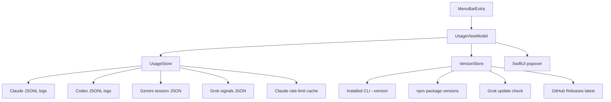
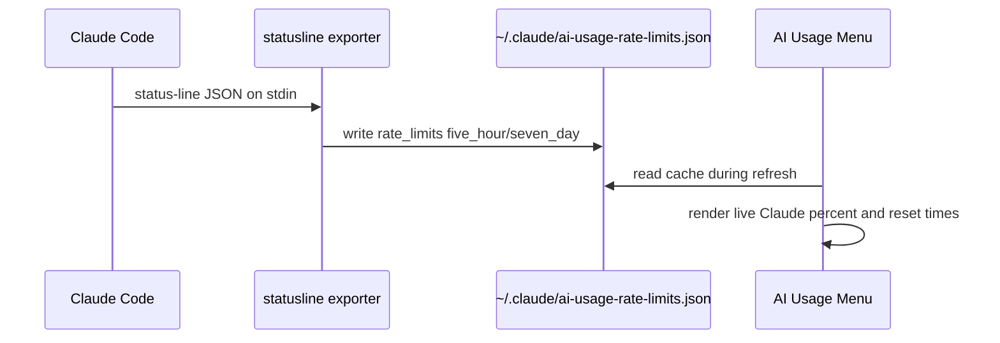
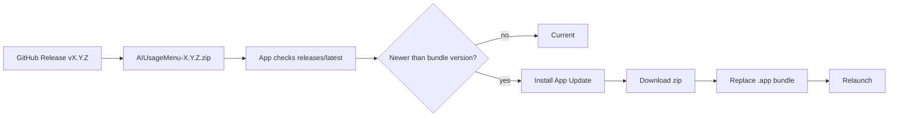

# AI Usage Menu

AI Usage Menu is a small macOS menu bar app for tracking local AI coding CLI usage across Claude Code, OpenAI Codex CLI, Gemini CLI, and Grok CLI.

It reads local transcript files, displays rolling token usage, shows reset windows when the CLI exposes them, checks installed CLI versions, and can update itself from GitHub Releases.

## Features

- Menu bar usage summary with the tightest live rate-limit percentage.
- Claude, Codex, Gemini, and Grok usage cards.
- Current 5 hour, today, and 7 day token totals.
- Input, output, cached, billable, and total token breakdowns.
- Claude Pro/Max 5 hour and weekly limits via Claude Code status-line JSON.
- Codex 5 hour and weekly limits from Codex `token_count` events.
- Exact reset timestamps, time remaining, percent left, and usage pace.
- Top projects by 7 day billable usage.
- Installed vs latest CLI versions for Claude, Codex, Gemini, and Grok.
- GitHub Releases based over-the-air app updates.

## Data Sources

| Tool | Local source | Limit source |
| --- | --- | --- |
| Claude Code | `~/.claude/projects/**/*.jsonl` | Claude status-line `rate_limits` cache |
| Codex CLI | `~/.codex/sessions/**/*.jsonl` | Codex `token_count.rate_limits` events |
| Gemini CLI | `~/.gemini/tmp/**/chats/session-*.json` | Local activity estimate |
| Grok CLI | `~/.grok/sessions/**/signals.json` | Local activity estimate |

Claude transcripts do not expose separate reasoning tokens, so Claude shows `Reason N/A`. Codex shows `Reason`, and Gemini shows `Thoughts`. Grok currently exposes aggregate session context tokens in `signals.json`, so the app tracks those as input tokens, leaves output/reasoning as `N/A`, and adds Grok-specific context-window, turn, tool-call, error, and latency telemetry.

## Architecture







## Install Claude Limit Exporter

Claude Code exposes Claude.ai Pro/Max rate-limit windows to status-line commands after the first API response in a session. Install the exporter to cache those windows for this menu app:

```sh
scripts/install-claude-statusline-exporter.sh
```

The installer backs up `~/.claude/settings.json`, sets the status-line command to `scripts/claude-statusline-exporter.sh`, and the exporter writes:

```text
~/.claude/ai-usage-rate-limits.json
```

If the cache is missing or older than 24 hours, the app falls back to local reset estimates.

## Run Locally

```sh
swift run AiUsageMenu
```

## Install On macOS

Install the latest GitHub release into `~/Applications` and launch it:

```sh
curl -fsSL https://raw.githubusercontent.com/happenings-dk/ai-usage/main/scripts/install.sh | bash
```

Override the install directory if needed:

```sh
AI_USAGE_INSTALL_DIR="/Applications" \
  bash -c "$(curl -fsSL https://raw.githubusercontent.com/happenings-dk/ai-usage/main/scripts/install.sh)"
```

## Build App Bundle

```sh
scripts/package-app.sh
open .build/release/AiUsageMenu.app
```

The packaged app sets `LSUIElement`, so it appears in the menu bar without a Dock icon.

Build metadata can be overridden:

```sh
AI_USAGE_VERSION=0.2.0 \
AI_USAGE_BUILD=2 \
AI_USAGE_GITHUB_REPO=happenings-dk/ai-usage \
scripts/package-app.sh
```

## Release On GitHub

Create a release zip and update metadata:

```sh
AI_USAGE_VERSION=0.2.0 scripts/package-release.sh
```

Upload the generated zip to a GitHub release:

```sh
gh release create v0.2.0 \
  .build/dist/AIUsageMenu-0.2.0.zip \
  .build/dist/update.json \
  --title v0.2.0 \
  --notes "AI Usage 0.2.0"
```

The app checks:

```text
https://api.github.com/repos/happenings-dk/ai-usage/releases/latest
```

It looks for a `.zip` asset containing `AiUsageMenu.app`, compares the release tag to the app bundle version, and offers `Install App Update` when a newer release is available.

To point a local build at another repository:

```sh
mkdir -p ~/.ai-usage
echo "happenings-dk/ai-usage" > ~/.ai-usage/github-repo
```

## Optional JSON Update Feed

GitHub Releases are the default. A plain JSON feed is also supported via:

```sh
mkdir -p ~/.ai-usage
echo "https://github.com/happenings-dk/ai-usage/releases/latest/download/update.json" > ~/.ai-usage/update-feed-url
```

Feed format:

```json
{
  "version": "0.2.0",
  "download_url": "https://github.com/happenings-dk/ai-usage/releases/download/v0.2.0/AIUsageMenu-0.2.0.zip"
}
```

## Development

Run tests:

```sh
swift test
```

Package and relaunch during local development:

```sh
scripts/package-app.sh
kill $(pgrep -f '/AiUsageMenu.app/Contents/MacOS/AiUsageMenu') 2>/dev/null || true
open .build/release/AiUsageMenu.app
```

## Requirements

- macOS 14 or later
- Swift 6 toolchain for local builds
- `jq` for the Claude status-line exporter
- `npm` for latest CLI version checks
