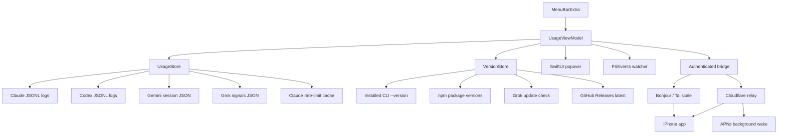
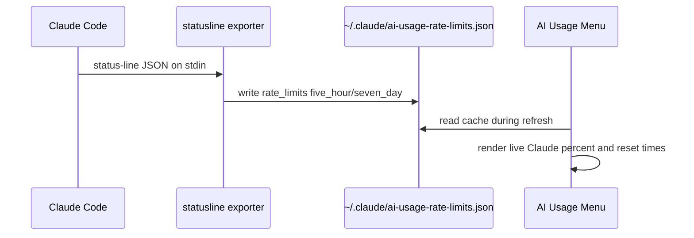
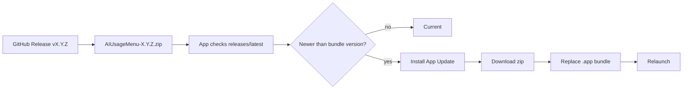

# AI Usage

AI Usage is a native macOS desktop and menu bar app for tracking local AI coding CLI usage across Claude Code, OpenAI Codex CLI, Gemini CLI, and Grok CLI.

It reads local transcript files, displays rolling token usage, shows reset windows when the CLI exposes them, checks installed CLI versions, and can update itself from GitHub Releases.

Signed DMG and one-command installs are included with releases starting at version 0.2.0. See [GitHub Releases](https://github.com/happenings-dk/ai-usage/releases) for published downloads.

## Features

- Menu bar usage summary with the tightest live rate-limit percentage.
- Full resizable desktop dashboard with a Dock icon.
- Floating Quick Look panel available from a global keyboard shortcut.
- Customizable one- or two-step Quick Look shortcut sequence in Settings (default: Shift-Command-U).
- Claude, Codex, Gemini, and Grok usage cards.
- Current 5 hour, today, and 7 day token totals.
- Input, output, cached, billable, and total token breakdowns.
- Claude Pro/Max 5 hour and weekly limits via Claude Code status-line JSON.
- Codex 5 hour and weekly limits from Codex `token_count` events.
- Exact reset timestamps, time remaining, percent left, and usage pace.
- Top projects by 7 day billable usage.
- Installed vs latest CLI versions for Claude, Codex, Gemini, and Grok.
- GitHub Releases based over-the-air app updates.
- Native iPhone dashboard with QR pairing and cached offline snapshots.
- Real-time Mac-to-iPhone updates over Bonjour, Tailscale, or an authenticated Cloudflare relay.
- APNs background refresh when iOS suspends the live WebSocket.

## Data Sources

| Tool | Local source | Limit source |
| --- | --- | --- |
| Claude Code | `~/.claude/projects/**/*.jsonl` | Claude status-line `rate_limits` cache |
| Codex CLI | `~/.codex/sessions/**/*.jsonl` | Codex `token_count.rate_limits` events |
| Gemini CLI | `~/.gemini/tmp/**/chats/session-*.json` | Local activity estimate |
| Grok CLI | `~/.grok/sessions/**/signals.json` | Local activity estimate |

Claude transcripts do not expose separate reasoning tokens, so Claude shows `Reason N/A`. Codex shows `Reason`, and Gemini shows `Thoughts`. Grok currently exposes aggregate session context tokens in `signals.json`, so the app tracks those as input tokens, leaves output/reasoning as `N/A`, and adds Grok-specific context-window, turn, tool-call, error, and latency telemetry.

## Architecture


```mermaid
flowchart TD
    A[MenuBarExtra] --> B[UsageViewModel]
    B --> C[UsageStore]
    B --> D[VersionStore]
    C --> E[Claude JSONL logs]
    C --> F[Codex JSONL logs]
    C --> G[Gemini session JSON]
    C --> H[Grok signals JSON]
    C --> I[Claude rate-limit cache]
    D --> J[Installed CLI --version]
    D --> K[npm package versions]
    D --> L[Grok update check]
    D --> M[GitHub Releases latest]
    B --> N[SwiftUI popover]
    B --> O[FSEvents watcher]
    B --> P[Authenticated bridge]
    P --> Q[Bonjour / Tailscale]
    P --> R[Cloudflare relay]
    Q --> S[iPhone app]
    R --> S
    R --> T[APNs background wake]
```


```mermaid
sequenceDiagram
    participant Claude as Claude Code
    participant Exporter as statusline exporter
    participant Cache as ~/.claude/ai-usage-rate-limits.json
    participant App as AI Usage Menu

    Claude->>Exporter: status-line JSON on stdin
    Exporter->>Cache: write rate_limits five_hour/seven_day
    App->>Cache: read cache during refresh
    App->>App: render live Claude percent and reset times
```


```mermaid
flowchart LR
    A[GitHub Release vX.Y.Z] --> B[AIUsageMenu-X.Y.Z.zip]
    B --> C[App checks releases/latest]
    C --> D{Newer than bundle version?}
    D -- no --> E[Current]
    D -- yes --> F[Install App Update]
    F --> G[Download zip]
    G --> H[Replace .app bundle]
    H --> I[Relaunch]
```

## Install Claude Limit Exporter

Claude Code exposes Claude.ai Pro/Max rate-limit windows to status-line commands after the first API response in a session. Install the exporter to cache those windows for this menu app:

```sh
scripts/install-claude-statusline-exporter.sh
```

The installer backs up `~/.claude/settings.json`, sets the status-line command to `scripts/claude-statusline-exporter.sh`, and the exporter writes:

```text
~/.claude/ai-usage-rate-limits.json
```

If the cache is missing or older than 24 hours, the app falls back to local reset estimates.

## Run Locally

```sh
swift run AiUsageMenu
```

## Live iPhone Sync

The Mac watches the four CLI data directories with FSEvents and rebuilds a snapshot after a short debounce. It broadcasts each versioned snapshot over an authenticated WebSocket and keeps HTTP as a one-shot fallback. The bridge is never unauthenticated: its device ID and local bearer token are generated in `~/.ai-usage` and embedded in the pairing QR.

Build and install the iPhone app from `apple/AIUsage.xcodeproj`, then open the Mac app's Settings and scan **Pair iPhone**. The phone chooses transports in this order:

1. Bonjour on the same LAN, with no DNS or address setup.
2. A direct `100.x` address when both devices are on the same Tailscale network.
3. The configured `wss://` relay when the Mac and phone cannot reach each other directly.

The phone caches the newest valid snapshot, reconnects with exponential backoff, and shows whether it is live, reconnecting, or offline. Pairing links contain credentials; treat the QR/link like a password and pair again after rotating either token.

### Internet relay

The deployable Cloudflare Worker lives in [`relay/`](relay/README.md). It uses one hibernatable Durable Object per channel, stores only the newest snapshot, and requires the same bearer credential for publishing, subscribing, snapshot fallback, and APNs registration. The Mac only makes an outbound connection, so the relay requires no inbound firewall or router configuration.

This workspace is configured against:

```text
https://ai-usage-relay.happenings.workers.dev
```

See the relay README for deployment, token rotation, and APNs secret setup. Foreground delivery is genuinely real-time over WebSocket. Background APNs delivery is opportunistic by iOS design and throttled to at most once every 20 minutes per channel.

## Install On macOS

For signed releases starting at version 0.2.0, choose either installation path:

> The current `v0.1.3` release predates secure distribution and is intentionally rejected. Use these options after `v0.2.0` is published; until then, use the local bundle instructions below.

1. **Download:** Open the DMG from [GitHub Releases](https://github.com/happenings-dk/ai-usage/releases) and drag `AiUsageMenu.app` to Applications.
2. **Terminal:** Install the latest release into `~/Applications` and launch it:

```sh
curl -fsSL https://raw.githubusercontent.com/happenings-dk/ai-usage/main/scripts/install.sh | bash
```

The terminal installer verifies the release checksum, expected bundle identifier, declared app version, Developer ID team, code signature, and Gatekeeper trust before replacing an existing copy. If installation fails, it restores the previous app. It rejects older releases without a checksum manifest.

The app also checks GitHub Releases over the air. Automatic installation appears only when the release has a matching SHA-256 checksum and the downloaded app passes bundle ID, version, Happenings Developer ID, code-signature, and Gatekeeper validation. A dedicated helper swaps the bundles atomically and restores the previous app if launch fails.

Install a specific version or skip launching it:

```sh
curl -fsSL https://raw.githubusercontent.com/happenings-dk/ai-usage/main/scripts/install.sh -o /tmp/install-ai-usage.sh
bash /tmp/install-ai-usage.sh --version 0.2.0 --no-launch
```

Override the install directory if needed:

```sh
AI_USAGE_INSTALL_DIR="/Applications" \
  bash -c "$(curl -fsSL https://raw.githubusercontent.com/happenings-dk/ai-usage/main/scripts/install.sh)"
```

## Build App Bundle

```sh
scripts/package-app.sh
open .build/release/AiUsageMenu.app
```

The packaged app appears in the Dock as a normal desktop app and keeps its live menu bar item available for quick checks.

Build metadata can be overridden:

```sh
AI_USAGE_VERSION=0.2.0 \
AI_USAGE_BUILD=2 \
AI_USAGE_GITHUB_REPO=happenings-dk/ai-usage \
scripts/package-app.sh
```

## Release On GitHub

The automated workflow builds a universal Apple silicon and Intel app, verifies it, and publishes ZIP, DMG, checksum, and update-feed assets. Update `VERSION` and `CHANGELOG.md`, then push a matching tag:

```sh
version="$(tr -d '[:space:]' < VERSION)"
git tag "v${version}"
git push origin "v${version}"
```

See [DISTRIBUTION.md](DISTRIBUTION.md) for Developer ID signing, notarization secrets, manual workflow runs, and local packaging.

The app checks:

```text
https://api.github.com/repos/happenings-dk/ai-usage/releases/latest
```

It looks for a `.zip` asset containing `AiUsageMenu.app`, compares the release tag to the app bundle version, and offers `Install App Update` when a newer release is available.

To point a local build at another repository:

```sh
mkdir -p ~/.ai-usage
echo "happenings-dk/ai-usage" > ~/.ai-usage/github-repo
```

## Optional JSON Update Feed

GitHub Releases are the default. A plain JSON feed is also supported via:

```sh
mkdir -p ~/.ai-usage
echo "https://github.com/happenings-dk/ai-usage/releases/latest/download/update.json" > ~/.ai-usage/update-feed-url
```

Feed format:

```json
{
  "version": "0.2.0",
  "download_url": "https://github.com/happenings-dk/ai-usage/releases/download/v0.2.0/AIUsageMenu-0.2.0.zip",
  "sha256": "0123456789abcdef0123456789abcdef0123456789abcdef0123456789abcdef"
}
```

## Development

Run tests:

```sh
swift test
```

Package and relaunch during local development:

```sh
scripts/package-app.sh
kill $(pgrep -f '/AiUsageMenu.app/Contents/MacOS/AiUsageMenu') 2>/dev/null || true
open .build/release/AiUsageMenu.app
```

## Requirements

- macOS 14 or later
- Swift 6 toolchain for local builds
- `jq` for the Claude status-line exporter
